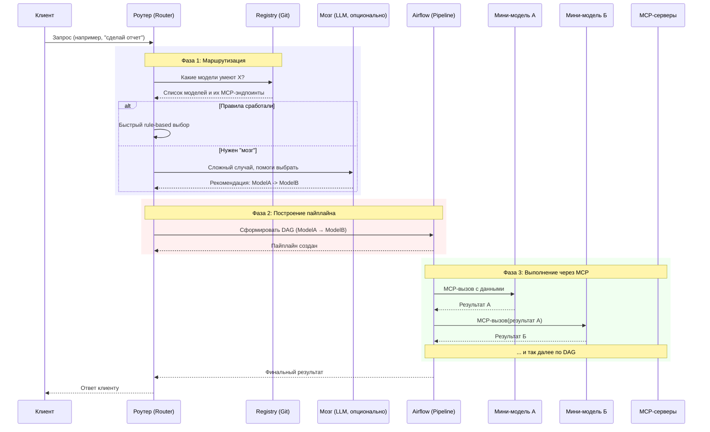

# balshoy-dispetcher



```mermaid
graph TB
    subgraph "Твоя система"
        Router[Роутер<br/>гибридный: правила + LLM]
        
        subgraph "Реестр (Git)"
            direction TB
            Git[(Git-репозиторий)]
            Configs[model-card.yml<br/>эндпоинты<br/>метаданные]
        end
        
        subgraph "Пайплайн"
            Airflow[Airflow<br/>с AI SDK]
        end
        
        subgraph "Модели как MCP-серверы"
            direction LR
            M1[MCP: извлечение дат]
            M2[MCP: SQL-генератор]
            M3[MCP: тональность]
            M4[...]
        end
    end
    
    subgraph "Внешнее"
        Client[Клиент]
        Brain[LLM-мозг<br/>для сложных случаев]
    end
    
    Client --> Router
    Router --> Git
    Router --> Brain
    
    Router --> Airflow
    Airflow --> M1
    Airflow --> M2
    Airflow --> M3
    Airflow --> M4
    
    M1 --> Airflow
    M2 --> Airflow
    M3 --> Airflow
    M4 --> Airflow
    
    Airflow --> Router
    Router --> Client
    ```
